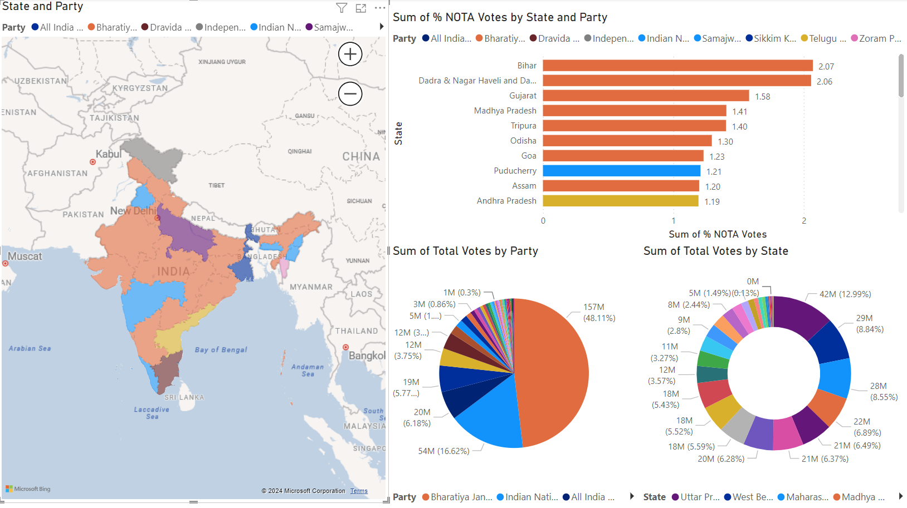

# 
🗳️ 2024 Indian General Election Data Analysis Report

1. **Uncontested Candidate**
   - Mukeshkumar Chandrakaant Dalal from Gujarat, Surat constituency, is the only uncontested candidate in the 2024 election.

2. **Duplicate Constituency Names**
   - India has two sets of constituencies with identical names: Aurangabad and Maharajganj in Bihar match those in Maharashtra and Uttar Pradesh, respectively.

3. **BJP Performance**
   - The Bharatiya Janata Party (BJP) won 240 constituencies, which is 44.11% of the total seats, while receiving 48.11% of the total votes.

4. **INC Performance**
   - The Indian National Congress (INC) secured 99 constituencies (18.23% of seats) with only 16.62% of the total votes.

5. **Voter Trust Levels**
   - Bihar showed the highest number of NOTA (None of the Above) votes, followed by Daman and Diu, indicating lower trust in the available candidates.

6. **Voter Turnout Comparison**
   - More people in West Bengal cast their votes than in Maharashtra, despite Maharashtra having a 20% larger population than West Bengal.

7. **Postal Votes**
   - A total of 3,744,508 votes were cast through postal ballots, accounting for 0.5% of the total votes.

8. **Most Prominent Party**
   - The BJP emerged as the most prominent party in the 2024 elections.

9. **Top Voting States**
   - Uttar Pradesh, West Bengal, and Maharashtra had the highest voter turnout. However, BJP did not secure the most constituencies in any of these states.

10. **Highest Number of Candidates**
    - The Karur constituency in Tamil Nadu had the highest number of candidates contesting in the 2024 elections, with a total of 55 candidates.

## PowerBI Dashboard

